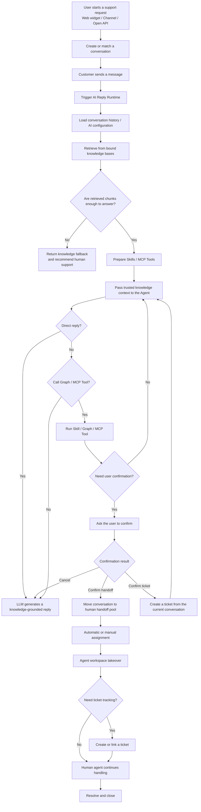
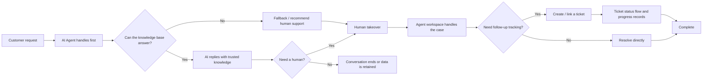
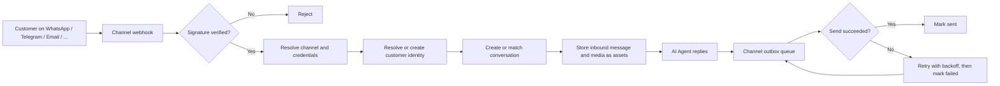

# Crove Desk

English | [简体中文](README_ZH.md)

An AI Agent customer support platform with knowledge-grounded answers, human handoff, ticket workflows, omnichannel messaging, a public self-service support portal, and self-hosted deployment.

> Crove Desk is built for teams that need online support, knowledge-base Q&A, human collaboration, and service tracking in one system. It is not an LLM inside a chat box; it is an AI Helpdesk designed around real support operations.

Crove Desk is a production fork of [`huabeitech/agent-desk`](https://github.com/huabeitech/agent-desk). Upstream is tracked as a git remote and merged in continuously; fixes that belong upstream are contributed back as pull requests. See [Relationship to upstream](#relationship-to-upstream).

## Product Preview

Customer chat, the agent workspace, the knowledge base, model configuration, AI Agent orchestration, channel integrations, and the public support portal are managed in one system.

> The screenshots below are inherited from upstream and still show the `AgentDesk` branding. The running product is branded `Crove Desk`.

### Customer Chat


Customers start a conversation from the web chat page or from any connected channel. The AI Agent responds first with knowledge-grounded answers. When the user explicitly asks for a human, the system starts a handoff confirmation flow.

### Agent Workspace


The support workspace includes conversation lists, message handling, AI-to-human handoff, agent replies, private internal notes, conversation tags, linked customers, and ticket context for daily support work.

### Knowledge Base and AI Agent Configuration

| Knowledge Base FAQ | AI Agent Configuration |
| --- | --- |
|  |  |

The knowledge base stores FAQs, documents, and retrievable content. AI Agents bind model configurations, knowledge bases, Skills, MCP tools, and visual workflows to create support agents for specific scenarios.

### Model Configuration


Model configuration supports OpenAI-compatible providers. You can configure LLMs, embedding models, rerank models, context limits, output settings, timeout, retry behavior, and enablement state.

## Why Use It

- **AI-first support**: AI Agents handle common questions, standard procedures, and knowledge-base answers first.
- **Knowledge-constrained replies**: RAG plus an Answerability Gate decides whether retrieved knowledge is strong enough to answer, reducing unsupported responses.
- **Natural human handoff**: Move to human agents when knowledge is insufficient, the user asks for help, or a workflow requires human confirmation.
- **Omnichannel by default**: 16 channel adapters feed one conversation model, so a customer who moves between WhatsApp, email, and web chat keeps one history.
- **Conversation-to-ticket loop**: Online chat, support handling, ticket creation, status flow, and progress records stay in one system.
- **Self-service portal**: A public support site with docs, community Q&A, and live chat reduces inbound volume before it reaches an agent.
- **Built for extension**: Go backend, Next.js frontend, and a runtime that supports Skills, MCP, and OpenAI-compatible model access.
- **Self-host friendly**: SQLite, MySQL, or PostgreSQL, with Qdrant or an embedded LanceDB build for local trials, intranet deployment, and enterprise self-hosting.

## Core Capabilities

### Support operations

- **AI Agent support**: AI replies first, with fallback, confirmation, tool calling, and human collaboration.
- **Online conversation system**: Visitor sessions, message send/receive, unread state, assignment, transfer, and close flows.
- **Agent workspace**: Take over conversations, reply, transfer teammates, link customers, add private internal notes, and create tickets.
- **Ticket system**: Create tickets from conversations, categorize, assign, move through status flows, record progress, and close the loop.
- **Support organization management**: Agent profiles, teams, schedules, and automatic assignment.
- **Customer management**: Unified customer records across channels, contact details, tags, and a merge dialog for combining duplicate omnichannel profiles.

### Knowledge and AI

- **Knowledge-base RAG**: Knowledge bases, documents, FAQs, chunking, vector retrieval, retrieval logs, and quality analysis.
- **Answerability Gate**: Checks whether retrieved content can support an answer; otherwise returns a fallback and recommends human support.
- **AI extensibility**: Skills, MCP debugging, external tool integration, and a visual workflow editor for multi-step agent behaviour.
- **Run observability**: AI workflow runs and agent runs are recorded and filterable for debugging live behaviour.

### Channels

Every channel maps onto the same conversation and customer model, so a customer who moves between WhatsApp, email, and web chat keeps one history.

| | | | |
| --- | --- | --- | --- |
| Web chat + embeddable widget | Email (multi-provider) | WhatsApp Business Cloud API | Facebook Messenger |
| Instagram Direct | Meta Threads | Telegram | Discord |
| Slack | X (Twitter) | TikTok | LINE |
| Viber | Zalo OA | WeChat MP | WeCom KF |

Outbound delivery for the messaging adapters is queued through a retrying outbox that cron drains, so a provider outage delays a reply instead of losing it. The web widget streams directly over WebSocket, and WeChat MP follows that platform's own passive-reply model.

Multi-tenant inbound email is supported through forwarding addresses of the form `help@<slug>.crove.io`, with direct-domain and plus-addressing routing.

### Public support portal

A customer-facing site under `/support` with self-service docs, community Q&A categories and threads, live chat, and user profiles — plus the dashboard side needed to moderate and author it.

## Localization

- **Dashboard and portal UI**: `zh-CN`, `en-US`, `vi-VN`
- **Backend messages and errors**: `zh-CN`, `en-US`

## Use Cases

- Website live support
- SaaS product support
- AI + human hybrid support
- Internal enterprise service desk
- After-sales service, incident reporting, complaints, and operations support
- Support teams that need knowledge-base Q&A with human collaboration across messaging channels

## Quick Start

The fastest way to run the full stack is Docker Compose. Compose reads a `.env` file, so create one first:

```bash
cp .env.example .env
docker compose up -d --build
```

Compose starts:

- `qdrant`: vector database with the `qdrant-data` volume, ports `6333` / `6334`
- `agent-desk`: the application, built from the local `Dockerfile` and tagged `crove-desk:latest`, on port `8083`

The bundled compose file expects PostgreSQL to be reachable from the container and reads its DSN from `DATABASE_URL`. Point that variable at your own database before starting; the default value targets a locally exposed Supabase instance and will not work as-is on a fresh machine.

After startup, open:

- Admin dashboard: `http://localhost:8083/dashboard`
- Agent workspace: `http://localhost:8083/dashboard/conversations`
- Public support portal: `http://localhost:8083/support`
- Customer web integration demo: `http://localhost:8083/support/demo`
- Customer chat page: `http://localhost:8083/support/chat`

Default administrator account:

- Username: `admin`
- Password: `ChangeMe123!`

> Before exposing the system to the public internet or a team environment, change the default administrator password and configure independent authentication, session, and model secrets.

Two LanceDB compose variants are also available for deployments that prefer an embedded vector store over Qdrant:

- `docker-compose.lancedb.yml`
- `docker-compose.sqlite-lancedb.yml`

## Documentation

Documentation lives in this repository:

| Document | Contents |
| --- | --- |
| [docs/ARCHITECTURE.md](docs/ARCHITECTURE.md) | System architecture and layer responsibilities |
| [docs/OMNICHANNEL_CONVERSATIONAL_SUPPORT_REFACTOR.md](docs/OMNICHANNEL_CONVERSATIONAL_SUPPORT_REFACTOR.md) | How every channel is mapped onto one conversation model |
| [docs/CROVE_DESK_PRODUCT_BACKLOG.md](docs/CROVE_DESK_PRODUCT_BACKLOG.md) | Product backlog with stable IDs and priorities |
| [docs/CROVE_DESK_AUDIT.html](docs/CROVE_DESK_AUDIT.html) | Security and correctness audit, tracked by ID with verification status |
| [CHANGELOG.md](CHANGELOG.md) | Release notes |
| [AGENTS.md](AGENTS.md) | Working agreement and conventions for contributors and AI agents |

To embed customer support on your website, load `web/public/sdk/agent-desk-sdk.min.js` and call `AgentDeskWidget.mount({ channelId })`. The `/support/demo` page is a working reference integration.

> The widget's public globals keep their `AgentDesk*` names. Renaming them would break every site that has already integrated the SDK, so they are a stable contract.

## Local Development

### Requirements

- Go `1.26+`
- Node.js `20+`
- `pnpm`
- Qdrant (or an embedded LanceDB build)

### Prepare Configuration

```bash
cp config/config.example.yaml config/config.yaml
cp .env.example .env
```

The default configuration uses:

- SQLite: `data/app.db`
- Backend: `http://127.0.0.1:8083`
- Qdrant gRPC: `127.0.0.1:6334`

If Qdrant is not running locally, start it with Docker:

```bash
docker run -p 6333:6333 -p 6334:6334 qdrant/qdrant
```

Install frontend dependencies:

```bash
cd web
pnpm install
cd ../flowgram-editor
pnpm install
cd ..
```

Start backend and frontend development servers together:

```bash
task dev
```

Default development URLs:

- Admin dashboard: `http://localhost:3000/dashboard`
- Agent workspace: `http://localhost:3000/dashboard/conversations`
- Public support portal: `http://localhost:3000/support`
- Customer web integration demo: `http://localhost:3000/support/demo`
- Customer chat page: `http://localhost:3000/support/chat`

### Checks

```bash
go test ./...                 # backend tests
cd web && pnpm typecheck      # frontend types
cd web && pnpm lint           # frontend lint
```

## Tech Stack

- Backend: Go + Gin + GORM + `github.com/mlogclub/simple`
- Frontend: Next.js 16 + React 19 + shadcn/ui on Base UI + Tailwind CSS
- Workflow editor: React + rsbuild, built into `web/public/flowgram-editor`
- Database: SQLite / MySQL / PostgreSQL
- Vector DB: Qdrant, or LanceDB through an optional CGO build
- AI: OpenAI-compatible LLM / Embedding + RAG + Skills + MCP
- Localization: `zh-CN`, `en-US`, `vi-VN`

## Project Structure

```text
.
├── cmd/                    # server / migration / generator / enums / testdata
├── internal/
│   ├── bootstrap/          # startup, routes, database, and migration initialization
│   ├── builders/           # model / aggregate result to response DTO mapping
│   ├── handlers/           # dashboard / api / third HTTP handlers
│   ├── middleware/         # Gin middleware
│   ├── migration/          # idempotent versioned data migrations
│   ├── models/             # GORM models
│   ├── repositories/       # data access layer
│   ├── services/           # business orchestration and transaction boundaries
│   ├── ai/                 # LLM / RAG / Runtime / Skills / MCP
│   ├── pkg/                # config / dto / enums / httpx / i18nx / utils
│   └── <channel>/          # one package per external channel client
├── web/                    # Next.js frontend project
│   ├── app/(dashboard)/    # admin dashboard and agent workspace
│   ├── app/(support)/      # public support portal, chat, docs, community
│   ├── components/         # React components, including shared dashboard CRUD
│   ├── i18n/               # locale configuration and providers
│   ├── messages/           # zh-CN / en-US / vi-VN message catalogs
│   ├── lib/                # API client, SDK source, and utilities
│   └── public/sdk/         # built embeddable widget SDK
├── flowgram-editor/        # visual AI workflow editor source
├── config/                 # configuration files
├── docker/                 # in-container configuration
├── docs/                   # architecture, backlog, and audit documentation
└── screenshots/            # README images
```

## Common Commands

```bash
task dev                  # start backend and frontend development servers
task dev:backend          # start only the Go server
task dev:frontend         # start only the Next.js dev server
task build                # build the flowgram editor, frontend SPA, and Go binary into dist/
task build:lancedb        # build the current-platform LanceDB binary into dist/
task build:flowgram-editor # build the workflow editor into web/public/flowgram-editor
task release              # build linux/darwin/windows release binaries into dist/
task release:lancedb      # build LanceDB release binaries into dist/
task generator            # run CRUD code generation
task enums                # generate frontend enums from backend definitions
task --list               # show available tasks
```

The widget SDK is built separately:

```bash
cd web && pnpm build:sdk
```

## AI Agent Workflow



## Support Loop



## Channel Message Flow



## Docker Image

If you only need the application image and will provide the database and vector store yourself:

```bash
docker build -t crove-desk:latest .
docker run --rm -p 8083:8083 \
  -v $(pwd)/docker/agent-desk.yaml:/app/config/config.yaml:ro \
  -v crove-desk-data:/app/data \
  crove-desk:latest
```

Compose uses [docker/agent-desk.yaml](docker/agent-desk.yaml) as the in-container configuration, and reaches `qdrant` through the Docker service name.

## Relationship to upstream

Crove Desk tracks [`huabeitech/agent-desk`](https://github.com/huabeitech/agent-desk) as the `upstream` remote and merges it into `dev` on an ongoing basis. `.github/workflows/sync-upstream.yml` automates that sync and skips a release when this fork already holds a tag of the same name, which is why release tags carry a `-crove.N` suffix.

Fixes that are not Crove-specific are contributed back upstream rather than kept local. Crove-specific additions — the omnichannel adapters, the public support portal, multi-tenant email routing, Vietnamese localization, and the hardened upload and webhook handling — live in this repository.

## License

See [LICENSE](LICENSE).
