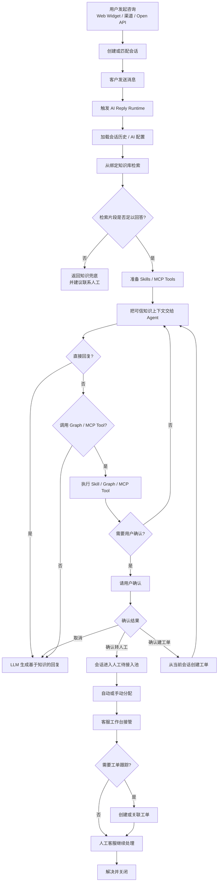
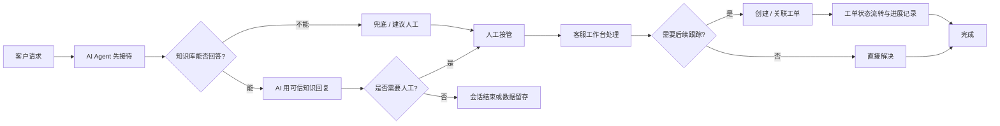
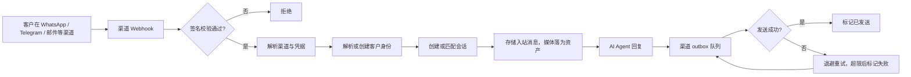

# Crove Desk

[English](README.md) | 简体中文

一套 AI Agent 客服平台，提供知识库约束回答、人工接管、工单闭环、全渠道消息接入、面向客户的自助支持门户，以及私有化部署能力。

> Crove Desk 面向需要同时处理在线咨询、知识库问答、人工协同和服务跟踪的团队。它不是把 LLM 接进聊天框，而是一套围绕真实客服运营设计的 AI Helpdesk。

Crove Desk 是 [`huabeitech/agent-desk`](https://github.com/huabeitech/agent-desk) 的生产环境分支。上游作为 git remote 持续跟踪并合入；属于上游的修复会以 Pull Request 回馈。详见[与上游的关系](#与上游的关系)。

## 产品预览

客户侧在线咨询、客服工作台、知识库、模型配置、AI Agent 编排、渠道接入和公开支持门户都在同一套系统中完成。

> 下方截图沿用自上游，仍显示 `AgentDesk` 品牌。实际运行的产品品牌为 `Crove Desk`。

### 客户侧在线咨询


客户可以从 Web 聊天页或任意已接入渠道发起咨询。AI Agent 会先接待，基于知识库回答问题；当用户明确要求人工介入时，会触发转人工确认流程。

### 客服工作台


客服工作台支持会话列表、消息处理、AI 转人工、客服回复、内部私密备注、会话标签、关联客户和工单信息查看，适合客服日常接待使用。

### 知识库与 AI 配置

| 知识库 FAQ | AI Agent 配置 |
| --- | --- |
|  |  |

知识库用于沉淀 FAQ、文档和可检索内容；AI Agent 可以绑定模型配置、知识库、Skills、MCP 工具和可视化工作流，形成面向具体客服场景的智能客服实例。

### 模型配置


模型配置支持 OpenAI-compatible 接入方式，可分别配置大语言模型、向量模型和重排模型，并管理上下文、输出、超时、重试和启用状态。

## 为什么选择它

- **AI 先接待**：让 AI Agent 优先处理常见问题、标准流程和知识库问答。
- **知识约束回答**：通过 RAG 和 Answerability Gate 判断知识片段是否足以回答，减少超出知识库范围的乱答。
- **自然转人工**：当知识库不足、用户明确要求或流程需要人工确认时，进入人工接管。
- **默认全渠道**：16 个渠道适配器汇入同一套会话模型，客户在 WhatsApp、邮件和 Web 聊天之间切换时历史不丢失。
- **会话到工单闭环**：在线会话、客服接待、工单创建、状态流转和处理记录在同一套系统里完成。
- **自助支持门户**：面向客户的公开站点提供文档、社区问答和在线咨询，在到达客服之前先消化一部分咨询量。
- **适合二次开发**：后端使用 Go，前端使用 Next.js，运行时支持 Skills、MCP 和 OpenAI-compatible 模型接入。
- **可私有化部署**：支持 SQLite、MySQL 或 PostgreSQL，向量库可选 Qdrant 或内嵌 LanceDB 构建，适合本地体验、内网部署和企业自托管。

## 核心能力

### 客服运营

- **AI Agent 客服**：AI 优先回复，支持兜底、确认、工具调用和人工协同。
- **在线会话系统**：支持访客会话、消息收发、未读状态、会话分配、转接和关闭。
- **客服工作台**：接管会话、回复用户、转接同事、关联客户、添加内部私密备注和创建工单。
- **工单系统**：支持从会话创建工单、分类、指派、状态流转、进展记录和闭环处理。
- **客服组织管理**：支持客服档案、客服组、排班和自动分配能力。
- **客户管理**：跨渠道统一客户档案、联系方式、标签，以及合并重复全渠道档案的合并对话框。

### 知识与 AI

- **知识库 RAG**：支持知识库、文档、FAQ、切片、向量检索、检索日志和质量分析。
- **Answerability Gate**：判断检索内容是否足以支撑回答，不足时返回兜底提示并建议联系人工。
- **AI 扩展能力**：支持 Skills、MCP 调试、外部工具接入，以及用于编排多步 Agent 行为的可视化工作流编辑器。
- **运行可观测性**：AI 工作流运行和 Agent 运行均有记录并可筛选，便于排查线上行为。

### 渠道

所有渠道都映射到同一套会话和客户模型，客户在渠道之间切换时历史保持连续：

| | | | |
| --- | --- | --- | --- |
| Web 聊天 + 可嵌入 Widget | 邮件（多服务商） | WhatsApp Business Cloud API | Facebook Messenger |
| Instagram Direct | Meta Threads | Telegram | Discord |
| Slack | X (Twitter) | TikTok | LINE |
| Viber | Zalo OA | 微信公众号 | 企业微信客服 |

消息类渠道的出站投递统一进入带重试的 outbox 队列，由定时任务消费，因此服务商故障只会让回复延迟而不会丢失。Web Widget 通过 WebSocket 直连，微信公众号遵循该平台自身的被动回复模型。

多租户入站邮件支持 `help@<slug>.crove.io` 形式的转发地址，并支持独立域名和 plus-addressing 路由。

### 公开支持门户

`/support` 下面向客户的站点，包含自助文档、社区问答分类与帖子、在线咨询和用户资料页，以及后台对应的内容创作与审核能力。

## 多语言

- **后台与门户界面**：`zh-CN`、`en-US`、`vi-VN`
- **后端消息与错误**：`zh-CN`、`en-US`

## 适用场景

- 官网在线客服
- SaaS 产品支持
- AI + 人工混合接待
- 企业内部服务台
- 售后、报障、投诉和运营支持
- 需要跨消息渠道进行知识库问答与人工协同的客服团队

## 快速开始

推荐先用 Docker Compose 运行完整服务。Compose 会读取 `.env`，因此需要先创建：

```bash
cp .env.example .env
docker compose up -d --build
```

Compose 会启动：

- `qdrant`：向量数据库，数据卷 `qdrant-data`，端口 `6333` / `6334`
- `agent-desk`：应用服务，由本地 `Dockerfile` 构建并打标签 `crove-desk:latest`，端口 `8083`

仓库自带的 compose 文件假定容器内可以访问 PostgreSQL，并从 `DATABASE_URL` 读取连接串。启动前请把它指向你自己的数据库；默认值指向一个本地暴露的 Supabase 实例，在全新环境上无法直接使用。

启动后访问：

- 管理后台：`http://localhost:8083/dashboard`
- 客服工作台：`http://localhost:8083/dashboard/conversations`
- 公开支持门户：`http://localhost:8083/support`
- 客户侧 Web 接入示例：`http://localhost:8083/support/demo`
- 客户侧聊天页：`http://localhost:8083/support/chat`

默认管理员账号：

- 用户名：`admin`
- 密码：`ChangeMe123!`

> 首次用于公网或团队环境前，请务必修改默认管理员密码，并配置独立的鉴权、会话和模型密钥。

如果希望使用内嵌向量库替代 Qdrant，仓库另提供两个 LanceDB compose 变体：

- `docker-compose.lancedb.yml`
- `docker-compose.sqlite-lancedb.yml`

## 文档

文档都放在本仓库中：

| 文档 | 内容 |
| --- | --- |
| [docs/ARCHITECTURE.md](docs/ARCHITECTURE.md) | 系统架构与分层职责 |
| [docs/OMNICHANNEL_CONVERSATIONAL_SUPPORT_REFACTOR.md](docs/OMNICHANNEL_CONVERSATIONAL_SUPPORT_REFACTOR.md) | 各渠道如何映射到同一套会话模型 |
| [docs/CROVE_DESK_PRODUCT_BACKLOG.md](docs/CROVE_DESK_PRODUCT_BACKLOG.md) | 带稳定 ID 和优先级的产品 Backlog |
| [docs/CROVE_DESK_AUDIT.html](docs/CROVE_DESK_AUDIT.html) | 安全与正确性审计，按 ID 跟踪并记录验证状态 |
| [CHANGELOG.md](CHANGELOG.md) | 发布说明 |
| [AGENTS.md](AGENTS.md) | 贡献者与 AI Agent 的工作约定和代码规范 |

如需在官网或产品中嵌入客服入口，加载 `web/public/sdk/agent-desk-sdk.min.js` 并调用 `AgentDeskWidget.mount({ channelId })`。`/support/demo` 页面是一个可运行的接入示例。

> Widget 对外的全局变量保留 `AgentDesk*` 命名。改名会破坏所有已经接入 SDK 的站点，因此它是一个稳定契约。

## 本地开发

### 环境要求

- Go `1.26+`
- Node.js `20+`
- `pnpm`
- Qdrant（或使用内嵌 LanceDB 构建）

### 准备配置

```bash
cp config/config.example.yaml config/config.yaml
cp .env.example .env
```

默认配置使用：

- SQLite：`data/app.db`
- Backend：`http://127.0.0.1:8083`
- Qdrant gRPC：`127.0.0.1:6334`

如果本地还没有 Qdrant，可以用 Docker 启动：

```bash
docker run -p 6333:6333 -p 6334:6334 qdrant/qdrant
```

安装前端依赖：

```bash
cd web
pnpm install
cd ../flowgram-editor
pnpm install
cd ..
```

同时启动后端和前端开发服务：

```bash
task dev
```

开发环境默认入口：

- 管理后台：`http://localhost:3000/dashboard`
- 客服工作台：`http://localhost:3000/dashboard/conversations`
- 公开支持门户：`http://localhost:3000/support`
- 客户侧 Web 接入示例：`http://localhost:3000/support/demo`
- 客户侧聊天页：`http://localhost:3000/support/chat`

### 校验命令

```bash
go test ./...                 # 后端测试
cd web && pnpm typecheck      # 前端类型检查
cd web && pnpm lint           # 前端 lint
```

## 技术栈

- Backend：Go + Gin + GORM + `github.com/mlogclub/simple`
- Frontend：Next.js 16 + React 19 + 基于 Base UI 的 shadcn/ui + Tailwind CSS
- 工作流编辑器：React + rsbuild，构建产物输出到 `web/public/flowgram-editor`
- Database：SQLite / MySQL / PostgreSQL
- Vector DB：Qdrant，或通过可选 CGO 构建使用 LanceDB
- AI：OpenAI-compatible LLM / Embedding + RAG + Skills + MCP
- 多语言：`zh-CN`、`en-US`、`vi-VN`

## 项目结构

```text
.
├── cmd/                    # server / migration / generator / enums / testdata
├── internal/
│   ├── bootstrap/          # 启动、路由、数据库和迁移初始化
│   ├── builders/           # model / 聚合结果到响应 DTO 的映射
│   ├── handlers/           # dashboard / api / third HTTP 处理器
│   ├── middleware/         # Gin 中间件
│   ├── migration/          # 幂等的版本化数据迁移
│   ├── models/             # GORM 模型
│   ├── repositories/       # 数据访问层
│   ├── services/           # 业务编排与事务边界
│   ├── ai/                 # LLM / RAG / Runtime / Skills / MCP
│   ├── pkg/                # config / dto / enums / httpx / i18nx / utils
│   └── <channel>/          # 每个外部渠道客户端一个包
├── web/                    # Next.js 前端工程
│   ├── app/(dashboard)/    # 管理后台与客服工作台
│   ├── app/(support)/      # 公开支持门户、聊天、文档、社区
│   ├── components/         # React 组件，包含共享的 dashboard CRUD
│   ├── i18n/               # 语言配置与 Provider
│   ├── messages/           # zh-CN / en-US / vi-VN 文案
│   ├── lib/                # API client、SDK 源码和工具
│   └── public/sdk/         # 构建后的可嵌入 Widget SDK
├── flowgram-editor/        # 可视化 AI 工作流编辑器源码
├── config/                 # 配置文件
├── docker/                 # 容器内配置
├── docs/                   # 架构、Backlog 与审计文档
└── screenshots/            # README 图片
```

## 常用命令

```bash
task dev                  # 同时启动后端和前端开发服务
task dev:backend          # 只启动 Go 服务
task dev:frontend         # 只启动 Next.js 开发服务
task build                # 构建工作流编辑器、前端 SPA 和 Go 二进制到 dist/
task build:lancedb        # 构建当前平台的 LanceDB 二进制到 dist/
task build:flowgram-editor # 构建工作流编辑器到 web/public/flowgram-editor
task release              # 构建 linux/darwin/windows 发布二进制到 dist/
task release:lancedb      # 构建 LanceDB 发布二进制到 dist/
task generator            # 运行 CRUD 代码生成
task enums                # 从后端定义生成前端枚举
task --list               # 查看所有可用任务
```

Widget SDK 单独构建：

```bash
cd web && pnpm build:sdk
```

## AI Agent 工作流



## 业务闭环



## 渠道消息流



## Docker 镜像

如果只需要应用镜像，数据库和向量库自行准备：

```bash
docker build -t crove-desk:latest .
docker run --rm -p 8083:8083 \
  -v $(pwd)/docker/agent-desk.yaml:/app/config/config.yaml:ro \
  -v crove-desk-data:/app/data \
  crove-desk:latest
```

Compose 使用 [docker/agent-desk.yaml](docker/agent-desk.yaml) 作为容器内配置，并通过 Docker 服务名访问 `qdrant`。

## 与上游的关系

Crove Desk 以 `upstream` remote 跟踪 [`huabeitech/agent-desk`](https://github.com/huabeitech/agent-desk)，并持续合入 `dev` 分支。`.github/workflows/sync-upstream.yml` 负责自动同步，当本分支已存在同名 tag 时会跳过该次发布，这也是发布 tag 带 `-crove.N` 后缀的原因。

非 Crove 专属的修复会回馈上游而不是只留在本地。Crove 专属的新增能力——全渠道适配器、公开支持门户、多租户邮件路由、越南语本地化，以及加固后的上传和 Webhook 处理——都维护在本仓库中。

## 许可证

见 [LICENSE](LICENSE)。
