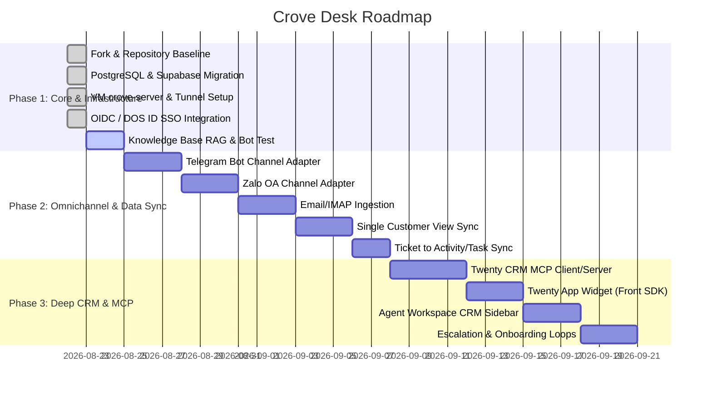

# 🚀 Crove Desk Roadmap

Development and deployment roadmap for **Crove Desk** (`desk.crove.com`) — an AI-first HelpDesk and Customer Support system deeply integrated into the **Crove Business OS** ecosystem alongside **Twenty CRM** (`crm.crove.com`) and Supabase PostgreSQL.

---

## 📌 Phases Overview

---

## 🎯 Phase Details

### 🔷 Phase 1: Core Platform & Infrastructure Deployment
*Goal: Deploy Crove Desk to standalone production at `desk.crove.com`, connect Supabase PostgreSQL (`desk` schema), and set up Qdrant Vector DB.*

- [x] **1.1. Repository Baseline**:
  - [x] Fork source base from `huabeitech/agent-desk` into GitHub organization `DOS` (`https://github.com/DOS/Crove-Desk`).
  - [x] Establish system architecture documentation (`docs/ARCHITECTURE.md`) and development guidelines (`AGENTS.md`).
- [x] **1.2. Database & Vector DB Configuration**:
  - [x] Configure PostgreSQL support with Supabase `dos.me` (`desk` schema, `desk_app` role, Session Pooler port `5432`).
  - [x] Ensure cross-database model compatibility for PostgreSQL, MySQL, and SQLite.
  - [x] Configure Qdrant Vector DB container on VM `crove-server` for Knowledge Base RAG.
- [x] **1.3. Production Docker & Cloudflare Tunnel Deployment**:
  - [x] Configure `docker-compose.prod.yml` and Dockerfile for containerized deployment on VM `crove-server`.
  - [x] Route Cloudflare Tunnel for `desk.crove.com` to `desk-server:8083`.
- [x] **1.4. Authentication & SSO**:
  - [x] Configure OIDC SSO integration with DOS ID (`/api/auth/oidc_login` and `/api/auth/callback/custom`).
- [ ] **1.5. Knowledge Base & AI Configuration**:
  - [ ] Initialize product knowledge base (FAQs, Crove product documents).
  - [ ] Configure OpenAI-compatible LLM / Embedding model providers and test Answerability Gate.

---

### 🔷 Phase 2: Omnichannel Adapters & Customer Data Sync
*Goal: Expand inbound communication channels (Telegram, Zalo OA, Email) and establish Single Customer View.*

- [ ] **2.1. Omnichannel Gateway Adapters**:
  - [ ] **Telegram Bot Webhook**: Ingest messages from Telegram users into Crove Desk Message Queue and provide bidirectional replies via Telegram Bot API.
  - [ ] **Zalo Official Account (OA) Webhook**: Integrate Zalo OA API, handle webhook events, and automate replies.
  - [ ] **Email / IMAP Ingestion**: Parse incoming support emails into conversations and tickets.
  - [ ] Unified channel routing via `internal/handlers/api/channel_handler.go` and `internal/services/channel_service.go`.
- [ ] **2.2. Single Customer View (Identity Synchronization)**:
  - [ ] First-time chat lookup: automatically match `email` / `phone` / `domain` with `Person` / `Company` in Twenty CRM.
  - [ ] Automatically create Lead / Person in Twenty CRM if not found.
  - [ ] Store `twenty_person_id` and `twenty_company_id` on the Crove Desk conversation session.
- [ ] **2.3. Ticket <-> Activity/Task Sync**:
  - [ ] Sync newly created Tickets to Twenty CRM as Timeline Activities or Tasks attached to customer records.

---

### 🔷 Phase 3: Deep CRM & MCP Protocol Integration
*Goal: Establish bidirectional Model Context Protocol (MCP) communication, embed UI components, and automate business-support workflows.*

- [ ] **3.1. Bidirectional MCP (Model Context Protocol)**:
  - [ ] **Crove Desk AI -> Twenty CRM MCP**:
    - AI Agent queries Company, Opportunity, and Subscription details to answer questions regarding contracts, expirations, and quotes.
    - AI Agent automatically creates Opportunities (new deals) and schedules demo Tasks for sales representatives.
  - [ ] **Twenty CRM AI -> Crove Desk MCP**:
    - AI Assistant in Twenty CRM queries Ticket summaries, resolution metrics, and customer sentiment scores.
- [ ] **3.2. Front Component & UI Embedding**:
  - [ ] **Twenty App Widget SDK**: Build an embedded widget rendering a **"Support Tickets"** tab inside Twenty CRM customer detail view.
  - [ ] **Agent Workspace Sidebar**: Display customer CRM context (tier, MRR/ARR, assigned sales rep) inside the live chat interface.
- [ ] **3.3. Automation & Event Loops**:
  - [ ] **Ticket Escalation Loop**: Negative sentiment or 1-star ratings trigger webhooks to create urgent tasks in Twenty CRM.
  - [ ] **Deal Won / Onboarding Loop**: Deal marked as `Closed Won` triggers a welcome message with onboarding material and VIP support tags.

---

## 🛠️ Quality & Engineering Standards

- [x] Strict one-way backend layering: `models -> repositories -> services -> handlers`
- [x] Multi-write operations wrapped in transactions (`sqls.WithTransaction`)
- [x] Full database compatibility across PostgreSQL (Supabase), MySQL, and SQLite
- [x] Frontend adheres to Next.js 16 App Router + shadcn/ui + Tailwind CSS
- [x] Standard date/time formatting: `yyyy-MM-dd HH:mm:ss` (`formatDateTime`)
- [x] Verified via Playwright MCP before deployment releases
