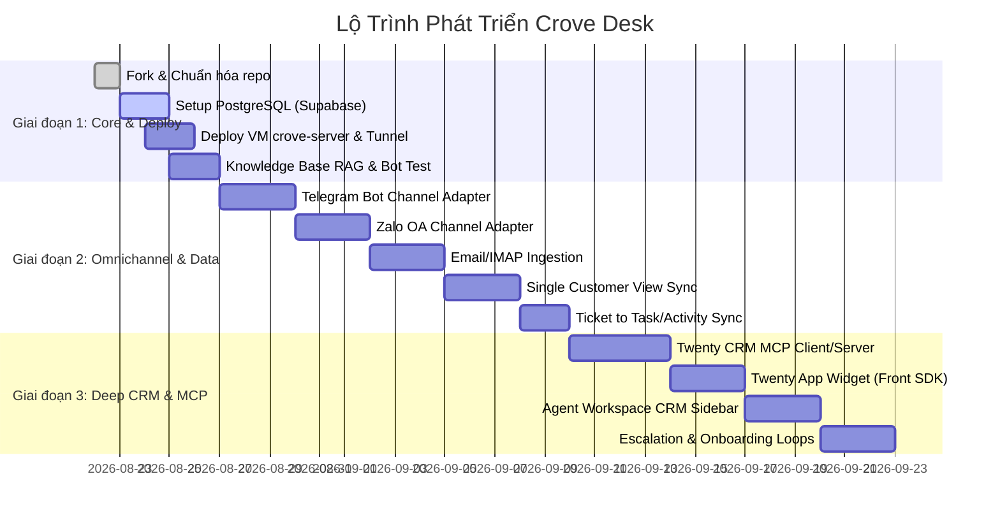

# 🚀 CROVE DESK ROADMAP

Lộ trình phát triển và triển khai **Crove Desk** (`desk.crove.com`) — Hệ thống AI HelpDesk & Customer Support thông minh tích hợp sâu vào hệ sinh thái **Crove OS** cùng **Twenty CRM** (`crm.crove.com`) và cơ sở dữ liệu Supabase `dos.me`.

---

## 📌 Tổng Quan Các Giai Đoạn (Phases Overview)

---

## 🎯 Chi Tiết Các Giai Đoạn

### 🔷 Giai đoạn 1: Triển Khai Nền Tảng & Hạ Tầng Core (Deploy Core & Supabase)
*Mục tiêu: Đưa Crove Desk lên môi trường sản xuất độc lập tại `desk.crove.com`, kết nối Database Supabase và Qdrant Vector DB.*

- [x] **1.1. Fork & Thiết lập Repository**:
  - [x] Fork source base từ `huabeitech/agent-desk` sang GitHub org `DOS` (`https://github.com/DOS/Crove-Desk`).
  - [x] Thiết lập bộ tài liệu kiến trúc kỹ thuật (`docs/ARCHITECTURE.md`) và quy chuẩn phát triển (`AGENTS.md`).
- [ ] **1.2. Cấu hình Database & Vector DB**:
  - [ ] Cấu hình kết nối PostgreSQL vào Supabase `dos.me` (Schema `desk`, user/role `desk_app`).
  - [ ] Đảm bảo cơ chế AutoMigrate tương thích cả PostgreSQL và SQLite/MySQL cho dev local.
  - [ ] Thiết lập Qdrant Vector DB local trên VM `crove-server` phục vụ RAG.
- [ ] **1.3. Triển khai Docker & Cloudflare Tunnel**:
  - [ ] Viết cấu hình `docker-compose.prod.yml` và Dockerfile tối ưu hóa cho Go binary + Next.js standalone.
  - [ ] Định tuyến Cloudflare Tunnel cho hostname `desk.crove.com` trỏ an toàn vào container `desk-server`.
- [ ] **1.4. Knowledge Base & AI Configuration**:
  - [ ] Khởi tạo bộ tài liệu tri thức (FAQ, tài liệu sản phẩm Crove).
  - [ ] Cấu hình kết nối LLM / Embedding model (OpenAI-compatible) và kiểm thử Answerability Gate.

---

### 🔷 Giai đoạn 2: Mở Rộng Đa Kênh & Đồng Bộ Dữ Liệu (Omnichannel Adapters & Data Sync)
*Mục tiêu: Mở rộng các cổng tiếp nhận tin nhắn từ Telegram, Zalo OA, Email và xây dựng tầng định danh khách hàng duy nhất.*

- [ ] **2.1. Omnichannel Adapters (Module Gateway đa kênh)**:
  - [ ] **Telegram Bot Webhook**: Nhận tin nhắn từ người dùng, đưa vào Message Inbound Queue của Crove Desk và gửi phản hồi 2 chiều qua Telegram Bot API.
  - [ ] **Zalo Official Account (OA) Webhook**: Tích hợp Zalo OA API, xử lý webhook sự kiện tin nhắn người dùng và phản hồi tự động.
  - [ ] **Email / IMAP Ingestion**: Tự động chuyển đổi email hỗ trợ từ khách hàng thành hội thoại/ticket.
  - [ ] Tích hợp thống nhất tại `internal/handlers/api/channel_handler.go` và `internal/services/channel_service.go`.
- [ ] **2.2. Single Customer View (Đồng bộ Danh tính Khách hàng)**:
  - [ ] Khi khách chat lần đầu: Tự động đối soát `email`/`phone`/`domain` với `Person`/`Company` trên Twenty CRM.
  - [ ] Tự động tạo Lead/Person mới trên Twenty CRM nếu chưa tồn tại.
  - [ ] Lưu vết liên kết `twenty_person_id` và `twenty_company_id` vào phiên hội thoại tại Crove Desk.
- [ ] **2.3. Đồng bộ Ticket <-> Activity/Task**:
  - [ ] Mỗi Ticket phát sinh từ hội thoại sẽ tự động bắn webhook sang Twenty CRM để tạo `Activity Timeline Event` hoặc `Task` gắn vào hồ sơ khách hàng.

---

### 🔷 Giai đoạn 3: Tích Hợp Sâu CRM & Giao Thức MCP (CRM & MCP Deep Integration)
*Mục tiêu: Kết nối 2 chiều qua giao thức MCP, nhúng giao diện và tự động hóa toàn bộ chu trình kinh doanh - hỗ trợ.*

- [ ] **3.1. Hai Chiều MCP (Model Context Protocol)**:
  - [ ] **Crove Desk AI -> Twenty CRM MCP**:
    - AI Agent tra cứu Company, Opportunity, Subscription để trả lời các câu hỏi về hợp đồng, hạn sử dụng, báo giá.
    - AI Agent tự động gọi Tool tạo Opportunity (Deal mới) và tạo Task hẹn lịch demo cho Sales.
  - [ ] **Twenty CRM AI -> Crove Desk MCP**:
    - AI Assistant trong Twenty CRM có thể tra cứu tóm tắt Ticket, lịch sử hỗ trợ và chỉ số hài lòng của từng khách hàng.
- [ ] **3.2. Front Component & UI Embedding**:
  - [ ] **Twenty App Widget SDK**: Xây dựng widget nhúng hiển thị tab **"Support Tickets"** ngay trên trang chi tiết khách hàng trong Twenty CRM.
  - [ ] **Agent Workspace Sidebar**: Tích hợp Sidebar hiển thị thông tin CRM trực tiếp (Hạng khách hàng VIP/Free, MRR/ARR, Sales phụ trách) bên cạnh màn hình chat.
- [ ] **3.3. Vòng Lặp Tự Động Hóa (Automation & Event Loops)**:
  - [ ] **Ticket Escalation Loop**: Khi khách đánh giá 1 sao hoặc phát hiện negative sentiment -> Gửi webhook kích hoạt Twenty Workflow tạo Task khẩn cấp cho Founder / Quản lý.
  - [ ] **Deal Won / Onboarding Loop**: Khi Deal trên Twenty CRM chuyển sang `Closed Won` -> Tự động kích hoạt bot gửi tin nhắn chào mừng và gắn thẻ VIP Support.

---

## 🛠️ Checklist Kiểm Thử & Tiêu Chuẩn Chất Lượng (Quality Standards)

- [ ] Kiểm tra kiến trúc phân tầng 1 chiều: `models -> repositories -> services -> handlers`
- [ ] Mọi write operation phức tạp phải nằm trong transaction `sqls.WithTransaction`
- [ ] Đảm bảo tương thích hoàn toàn cơ sở dữ liệu PostgreSQL (Supabase) và SQLite
- [ ] Frontend tuân thủ nghiêm ngặt Next.js 16 App Router + shadcn/ui + Tailwind CSS
- [ ] Định dạng thời gian chuẩn: `yyyy-MM-dd HH:mm:ss` (`formatDateTime`)
- [ ] Chạy kiểm thử tự động và kiểm tra giao diện bằng Playwright MCP trước khi release
