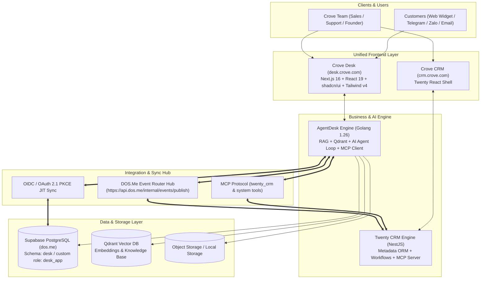
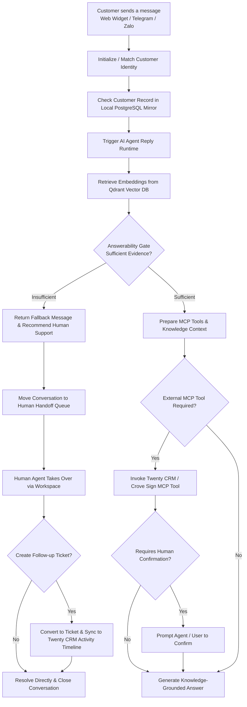

# Crove Desk System Architecture (Crove OS Architecture)

This document defines the overall architecture of **Crove Desk** (`desk.crove.com`), an AI-first intelligent HelpDesk and Customer Support system, and its deep integration with the **Crove Business OS** ecosystem, including **Twenty CRM** (`crm.crove.com`), **Crove Sign**, **Crove Post**, **Crove Cal**, and **DOS.Me ID**.

---

## 1. High-Level Architecture: 2-Tier Hybrid Pattern

To achieve **instant UI response (< 5ms)**, **database foreign key constraints**, and **autonomous AI Agent actions**, the Crove OS ecosystem adopts a **2-Tier Hybrid Architecture**:

```
┌─────────────────────────────────────────────────────────────────────────────────────────┐
│                           CROVE OS 2-TIER HYBRID ARCHITECTURE                           │
├──────────────────────────────────────────┬──────────────────────────────────────────────┤
│ TIER 1: Identity & Relational Mirror     │ TIER 2: Deep Agentic Business Actions        │
│ (Companies, Customers, Organizations)    │ (Create Deals, Quotas, Tasks, Contracts)     │
├──────────────────────────────────────────┼──────────────────────────────────────────────┤
│        DATABASE SYNCHRONIZATION          │                 MCP PROTOCOL                 │
│    (PostgreSQL Mirror nội bộ < 5ms)      │      (Model Context Protocol Tool Calling)   │
│                   │                      │                      │                       │
│  • Twenty CRM: Master SSOT               │  • twenty_crm.create_opportunity(...)        │
│  • Crove Desk: desk.t_company /          │  • twenty_crm.get_subscription_status(...)   │
│                desk.t_customer           │  • twenty_crm.create_task(...)               │
│  • Bi-directional Webhook Dispatch       │  • crove_sign.get_contracts(...)             │
│  • JIT (Just-In-Time) Onboarding         │  • Realtime dynamic side-effect execution    │
└──────────────────────────────────────────┴──────────────────────────────────────────────┘
```

### Why Crove Desk Maintains a Local Database Mirror (`desk.t_company`, `desk.t_customer`):
1. **Foreign Key Integrity**: Tickets (`desk.t_ticket`), chat conversations (`desk.t_conversation`), CSAT ratings, and SLA policies require direct `ticket.customer_id` and `ticket.company_id` relational constraints. Foreign keys cannot cross HTTP/MCP boundaries.
2. **Instant UI Rendering (< 5ms Latency)**: When an agent opens an inbox or ticket, company names, contact numbers, avatars, and VIP badges load immediately from local PostgreSQL, eliminating network latency (200ms–600ms).
3. **High-Performance Search & Indexing**: Enables instant searching, sorting, and filtering across thousands of customer records and conversations.
4. **Fault Isolation**: If Twenty CRM undergoes maintenance or network hiccups, Crove Desk continues accepting support chats and managing tickets uninterrupted.

---

## 2. System Interaction Topology



---

## 3. Four Core Integration Layers

### 3.1. Layer 1: Deep Agentic MCP Tool Calling
Bidirectional Model Context Protocol (MCP) communication between AI Agents:
* **Crove Desk AI -> Twenty CRM MCP**:
  * `twenty_crm.get_subscription_status`: Query active plans, quotas, and expiration dates.
  * `twenty_crm.create_opportunity`: Automatically create enterprise deals when a customer expresses buying intent.
  * `twenty_crm.create_task`: Schedule consultative demo calls for assigned account executives.
* **Crove Desk AI -> Crove Sign MCP**:
  * `crove_sign.get_contracts`: Check status of electronic agreements and pending signatures.

### 3.2. Layer 2: Real-time Event-Driven Webhook Sync (HMAC Verified)
When entities change in Twenty CRM or Crove Desk, events publish to `api.dos.me/internal/events/publish` and route to subscribers with `X-DOS-Signature: sha256=<hex_digest>` verification:
* `company.created` / `company.updated`: Syncs company profiles, domain names, and tiers.
* `customer.created` / `customer.updated`: Syncs customer names, emails, phones, job titles, and avatars.
* `organization.created` / `organization.updated`: Syncs multi-tenant workspaces.
* `organization.member.added` / `organization.member.removed`: Syncs team memberships and roles (`OWNER`, `ADMIN`, `MEMBER`).

### 3.3. Layer 3: Omnichannel Communication Gateway
Native inbound/outbound channel adapters normalize messages into the `Message Inbound Queue`:
* **Web Chat Widget**: Embeddable JavaScript SDK (`agent-desk-sdk.min.js`) with responsive desktop & mobile support.
* **Native Telegram Channel** *(In Progress)*: Direct Telegram Bot Webhook adapter (`/api/channels/telegram/webhook`) routing chats to agents and AI loop.
* **Zalo Official Account (OA)**: Webhook adapter for Vietnamese enterprise support.
* **Inbound Email Support**: IMAP / transactional email parsing into conversation tickets.

### 3.4. Layer 4: UI Embedding & Contextual Sidebars
* **Support Tab inside Twenty CRM**: Twenty App Widget SDK embedding real-time support history inside customer CRM profiles.
* **CRM Customer Sidebar in Desk Workspace**: Displays customer MRR, active plan, deal stage, and assigned account manager directly in the live agent workbench.

---

## 4. AI Support Lifecycle Flow & Answerability Gate



---

## 5. Technology Stack & Infrastructure

| Component | Technology | Details |
| :--- | :--- | :--- |
| **Backend Framework** | Golang (Go 1.26+) + Gin | High-concurrency async runtime, streaming WebSockets, REST APIs |
| **Data Layer** | GORM + `github.com/mlogclub/simple` | Clean layer ownership: `models -> repositories -> services -> handlers` |
| **Primary Database** | PostgreSQL (Supabase `dos.me`) | Schema `desk`, managing conversations, tickets, customers, users, orgs |
| **Vector Database** | Qdrant (`6333` REST / `6334` gRPC) | Vector embedding storage for Knowledge Base semantic retrieval |
| **AI Runtime** | OpenAI-compatible API (DOS.AI / OpenAI / DeepSeek) | Agent Loop orchestration, Answerability Gate, and MCP Tool calling |
| **Frontend** | Next.js 16 (Turbopack) + React 19 + Tailwind v4 + shadcn | Responsive Dashboard, Workbench, and Support Center (`en-US`, `vi-VN`, `zh-CN`) |
| **Hosting & Network**| GCP VM `crove-server` + Cloudflare Tunnel | High-availability Docker stack mapped to `desk.crove.com` |

---

## 6. DOS.Me Hierarchy Standard & Multi-Product Sync (Org -> Team / Project)

To maintain consistent multi-tenant organizational structure across all Crove OS member applications, DOS.Me acts as the central Identity & Organization Authority.

### 6.1. Cross-Product Entity Mapping Matrix

| DOS.Me Concept (SSOT) | Crove Desk (`desk.crove.com`) | Crove CRM (`crm.crove.com`) | Crove Sign (`sign.crove.com`) | Crove Post (`post.crove.com`) | Crove Cal (`cal.crove.com`) |
| :--- | :--- | :--- | :--- | :--- | :--- |
| **Organization (Tenant)** | `t_organization` | `Workspace` (`core.workspace`) | `Organisation` (`sign.organisation`)| `Organization` (`post.organization`) | `Organization` (`cal.organization`) |
| **Project / Team (Sub-unit)** | `t_agent_team` (Support Team) | `Group` / `Team` | `Team` (`sign.team`) | `Workspace Team` | `Team` (`cal.team`) |
| **User (Account)** | `t_user` + `t_agent_profile` (1:1)| `User` (`core.user`) | `User` (`sign.user`) | `User` (`post.user`) | `User` (`cal.user`) |

### 6.2. Two-Phase Synchronization Standard (JIT + Real-time Webhooks)

#### Phase 1: Just-In-Time (JIT) Provisioning upon OIDC Login
When a user logs in via DOS.Me OIDC, the `userinfo` claim supplies both organization and team memberships:
```json
{
  "sub": "usr_dos_123456",
  "email": "joy@dos.ai",
  "name": "Anh Le",
  "picture": "https://avatar.dos.me/joy.png",
  "organizations": [
    {
      "id": "org_dos_9988",
      "name": "DOS Corporation",
      "role": "ADMIN",
      "teams": [
        { "id": "proj_support_01", "name": "Customer Support", "slug": "support" },
        { "id": "proj_sales_02", "name": "Sales & Success", "slug": "sales" }
      ]
    }
  ]
}
```
* **Crove Desk Action**: Automatically ensures `t_organization`, provisions default/mapped `t_agent_team`, creates `t_user`, and guarantees 1-to-1 `t_agent_profile` association.

#### Phase 2: Real-time Event-Driven Webhooks (`X-DOS-Signature: sha256=...`)
When administrators create, update, or reorganize Teams/Projects in DOS.Me, webhook events are broadcast to member apps:
```json
{
  "event": "team.member_added",
  "timestamp": "2026-09-02T14:45:00Z",
  "data": {
    "org_id": "org_dos_9988",
    "team_id": "proj_support_01",
    "team_name": "Customer Support",
    "user_id": "usr_dos_123456",
    "user_email": "joy@dos.ai",
    "role": "ADMIN"
  }
}
```
* **Supported Team Events**: `team.created`, `team.updated`, `team.deleted`, `team.member_added`, `team.member_removed`.

